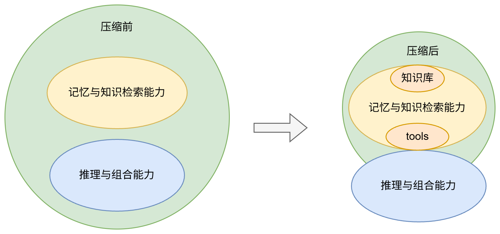

# 模型压缩技术

理解性分类： 量化、蒸馏、剪枝

技术性分类：

- 数值量化（Data Quantization）
- 模型稀疏化（Model sparsification）
- 知识蒸馏（Knowledge Distillation）
- 轻量化网络设计（Lightweight Network Design）
- 张量分解（Tensor Decomposition）

[Unified Scaling Laws for Compressed Representations](https://arxiv.org/abs/2506.01863) : 不同压缩方式（量化、稀疏、蒸馏）最终都在减少模型有效容量（Effective Capacity）

## 技术实现（什么技术能够达到效果 TODO）


## 丢失能力（通过这个技术实现导致能力变化 TODO）


# 实际需求分析（知识蒸馏）

> 需求：10~30B --> 1B

从压缩倍率看，知识蒸馏可以作为主要实现路线，但 10~30B 压缩到 1B 属于较大的容量迁移，不能简单理解为“保留大模型能力”。更合理的目标是：让 1B 学生模型在明确任务、领域知识和工具使用场景下尽量接近教师模型，同时接受通用泛化、长链推理和复杂规划能力的下降。

以下重点记录使用知识蒸馏完成参数压缩后，模型能力可能保留、提升或损失的部分。



[Capacity Gap（容量间隙）](https://aclanthology.org/2025.acl-long.1097.pdf)：容量间隙的本质，是小模型受到参数规模、层数和宽度等物理容量限制，因此在部分任务上存在能力上限。教师模型和学生模型差距越大，学生模型越容易出现“学不会”或只能学习表层行为的情况。


蒸馏容易保留的是结果，难保留的是产生结果的内部机制。

## 1. 能力分类

可以先将压缩后的能力变化分成两类：

- 记忆与知识检索能力：包括事实记忆、领域知识、RAG 问答和工具使用等。
- 推理与组合能力：包括长链推理、复杂规划、泛化和 In-context Learning 等。

更细的能力变化可以概括如下：

| 能力                    | 压缩后能否保留 |
| --------------------- | ------- |
| 语言流畅性                 | 基本可以    |
| 指令跟随                  | 基本可以    |
| 特定领域知识                | 可以      |
| 固定任务能力                | 可以      |
| Tool Calling          | 可以      |
| RAG 问答                | 可以      |
| 长链推理                  | 部分损失    |
| 复杂规划能力                | 明显下降    |
| In-context Learning 能力 | 明显下降    |
| 世界模型完整性               | 明显下降    |

注：世界模型完整性指模型对真实世界知识、关系和常识结构的综合建模能力，这部分通常需要较大的模型容量。RAG 问答能力指压缩后的小模型仍然能够利用外部知识库完成检索增强问答。

## 2. 容易保留的能力

知识蒸馏后较容易保留的是结构清晰、边界明确、训练数据覆盖充分的能力，例如：

- 语言流畅性和基础表达能力
- 指令跟随能力
- 固定任务能力
- 特定领域内的事实问答
- Tool Calling 和 RAG 问答流程

## 3. 可补偿的能力

小模型的知识覆盖和实时性不足，可以通过外部数据和系统设计进行补偿，但这类提升更多依赖工程方案，而不是模型参数本身。

在特定知识库或垂直场景中，通过高质量蒸馏数据、合成数据和持续训练，小模型在事实问答上的准确率有机会接近教师模型。也就是说，领域知识不足可以通过数据质量、训练时长和外部知识库进行补偿。

### 3.1 提升方式

- 高质量蒸馏数据
- 合成数据
- 外挂知识库
- 工具调用
- Test-Time Compute（增加推理时长）

## 4. 难以保留的能力

泛化与未见任务能力
- 小模型由于缺乏足够抽象的底层表征能力，会永久性地弱于大模型

长链推理能力
- 当问题复杂度超过一定阈值后，模型可能出现中间步骤错误累积，最终导致结果崩塌。

复杂规划能力
- 需要同时维护多个目标、约束和中间状态时，小模型更容易丢失上下文或选择短视策略。

In-context Learning 能力
- 小模型从少量上下文示例中抽象新规律的能力通常弱于大模型。

核心原因：推理和组合能力依赖模型内部形成复杂的计算结构。小模型的层数、宽度和注意力头数量有限，能够表达的函数复杂度也更有限，因此很难完整继承大模型的抽象推理能力。

论文证实：论文通过电路理论（Circuit Theory）和实验证明，小模型的层数（Depth）和每一层的宽度（Width）限制了它能表达的函数复杂度

## 5. 最优实现方案

模型压缩存在一个Capacity Gap，容量间隙过大会导致“学生学不会”情况

方案：通用能力 + 领域能力（知识库） + 外置能力调用（tools 调用、知识库）
- 通用能力：通过蒸馏保留基础语言能力、指令跟随和常见任务能力。
- 领域能力：通过高质量领域数据、合成数据和知识库增强补足专业知识。
- 外置能力：通过 Tool Calling、RAG 和其他工具调用补足实时知识、检索和计算能力。

理想情况下（例如 30B -> 1B），可以将目标拆成：保留60%通用能力，通过方法将领域知识能力提升至120%，以及工具能力，总体能力预估能达到80%

## 6. 总结

模型压缩必然带来能力损失，尤其是泛化、长链推理和复杂规划能力。知识蒸馏更适合用来保留语言表达、指令跟随和固定任务能力；对于领域知识和实时信息，应结合高质量数据、RAG 和工具调用进行补偿。

# 学术界具体实验研究简述

## 1.

[《What Do Compressed Deep Neural Networks Forget?》](https://arxiv.org/pdf/1911.05248)

### 实验设置

|数据集|模型|
|-----|----|
|ImageNet (1000类)| ResNet50|
|CelebA (40个标签) | CNN分类器|

### 压缩方法

量化和稀疏化

### 结论

模型压缩（剪枝）后，对于整体准确率计划不变，但实际会损失部分能力。

类比LLM得出：损失稀有知识的记忆（长尾知识）。但基础的分类或短问答，变化不大。

## 2. 

[《Quantization Hurts Reasoning? An Empirical Study on Quantized Reasoning Models》](https://arxiv.org/abs/2504.04823v1)


### 模型

- DS-R1-Distill-Qwen-1.5B 
- DS-R1-Distill-Qwen-7B 
- DS-R1-Distill-Qwen-14B 
- DS-R1-Distill-Qwen-32B


### Benchmark  

数学：AIME24、MATH500

科学推理：GPQA

代码推理：LiveCodeBench

### 实验维度

```
├── Weight-only Quantization
│      ├── AWQ-W4G128
│      └── AWQ-W3G128
│
├── KV Cache Quantization
│      ├── KVQuant-KV4
│      └── KVQuant-KV3
│
├── Weight-Activation Quantization
│      ├── FlatQuant-W8A8KV8
│      └── FlatQuant-W4A4KV4
│
└── BF16
       └── Baseline
```

### 结论

根据实验得出小参数模型对于长链推理能力呈现越小下降趋势越大。

## 3. 

[Phase transitions in large language model compression](https://www.nature.com/articles/s44387-026-00072-8)


### 实验配置

LLaMA-7B 为主要实验模型

Qwen2.5/7B/14B/72B/Gemma/LLaMA3.1-8B 补充验证

数据集：WikiText-2

### 压缩方法

- Structured Pruning实验
    - Layer Pruning
    - Attention Head Pruning
    - Block Pruning
- Unstructured Pruning实验
    - SparseGPT
    - Wanda
- Quantization实验
- Qwen（大模型是否更耐压缩）
    - 7B
    - 14B
    - 72B
- Low Rank实验
- 联合压缩实验

### 指标

PPL(perplexity) 

### 结论

> meaning the model can be compressed to ~10% of its original size without significant performance degradation.

论文原文指出，在各种方式的组合下，理论估计能达到10%压缩率

模型压缩有一个临界值，超过这个骤变值后对模型进行比较变得没有意义。

# 对实际项目影响

对于 Qwen3-o 实际的进行压缩

实际场景并不需要长链推理以及长尾知识的能力，因此理想情况下在控制好合理的压缩范围下，是能够达到需求的。但对于上下文理解能力，即知识记忆能力下降可以通过外置知识来实现。对于世界模型能力（即对世界的认知能力）在实际需求中并不太需要该能力。


# 从 10~30B 到 1B：压缩结论与能力取舍

以 Qwen3-o (30B) 作为source，根据调研分析以及实际需求，预期能够将30B模型压缩至3B大小（~10%）。

压缩将会损失一定的长链推理、长尾知识、上下文理解（知识记忆）、世界模型理解能力。上下文理解（知识记忆）能力可以通过外置知识来提升超100%，实际场景因对长链推理、长尾知识、世界模型理解能力的依赖不大，这些能力下降对最终实现效果影响不大。
