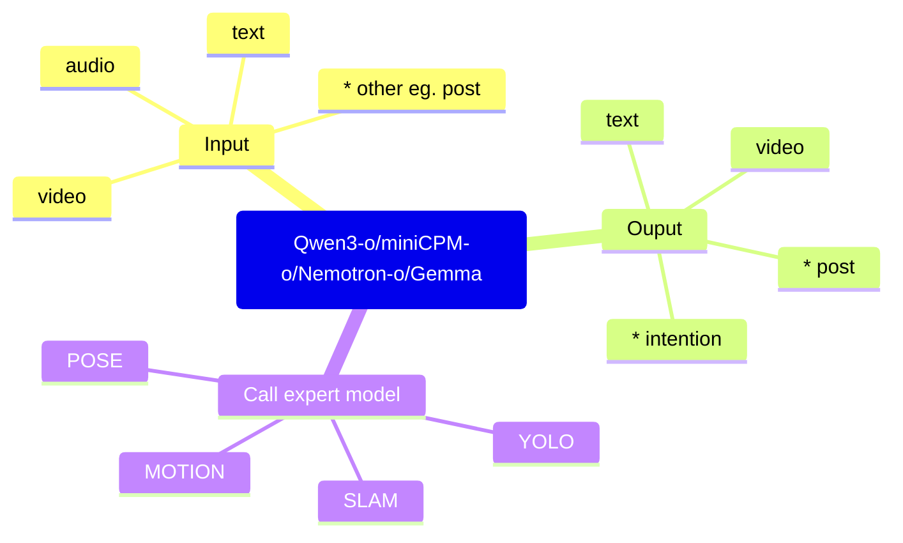

# 多模态模型选型

roadmap：基模获取小模型输出的结果来进行语音提示和action -> 多模态数据输入并多模态数据输出

> 核心议题：多模态大模型核心能力，模型规模，小模型天花板研究，能力评测

## 大模型 (VLM)

Qwen3-o

miniCPM-o

Nemotron-o

Gemma

### 核心能力

- 多模态输入输出，能够输入EMG信号，能够输出POST以及意图预测
- 具备类agent能力，能够调用小模型/tools去完成task

### 模型规模

7B 

原因：当前需要的大模型主要的能力是感知融合，根据openvla这个模型大概的参数量7B来估算出的

因为目前调研看下来，如果不是开放世界交互模型，正确性取决于数据和动作表示。

如果需要具备开放世界交互，模型规模看齐主流的LLM模型。

## VLA

目前主流代表性较强的：

[Magma](https://arxiv.org/abs/2502.13130)

[pai 0.5](https://arxiv.org/abs/2504.16054)

[Gemini Robotics](https://deepmind.google/models/gemini-robotics/)

目前这一类的模型还属于动作预测领域，与VLM在实现层面有一定相关性但功能性主流还是不会用其做开放世界的交互

## 小模型 

YOLO 目标检测

SLAM 定位建图 

MediaPipe/RTMPose 姿态/人体关节点 
- [RTMPose: Real-Time Multi-Person Pose Estimation based on MMPose](https://arxiv.org/abs/2303.07399)
- [mediapipe](https://github.com/google-ai-edge/mediapipe)

Motion 动作预测 
- [Human Motion Prediction, Reconstruction, and Generation](https://arxiv.org/abs/2502.15956)

### 天花板

Post: 

目前对于姿态检测的主流方式还是通过视觉进行对第三人称人体关节的姿态识别。（需要考虑这个功能是否有需求

对于第一人称人体姿态感知，目前可以通过运动意图感知组捕获的物理数据，输出姿态给到模型。

Motion: 

目前对于motion主要有四种task，reconstruction、prediction、generation、planning。对于当前机甲的贴切的是task是prediction + planning。

|任务	|输入	|输出	|对机甲价值|
|---|---|---|---|
|Motion Reconstruction	|视频/IMU	|当前姿态	|高|
|Motion Prediction	|历史动作	|未来动作	|极高|
|Motion Generation	|文本/条件	|动作序列	|中|
|Motion Planning	|目标+环境	|动作轨迹	|极高|

主流代表：

对于motion的技术路线一个是expert，一个是Human Foundation Model（大一统的机器人模型，多模态输入输出），目前主流是expert。

例：MDM
- GitHub [MDM](https://github.com/guytevet/motion-diffusion-model)
- paper [Human Motion Diffusion Model](https://arxiv.org/abs/2209.14916)

这个是一个对motion相关研究的分水岭，核心底层技术转为 Diffusion 。

有一个方向是类似LLM的自回归机制实现，将状态离散化/投影为token流，预测极短时间流。 
- paper [Humanoid Locomotion as Next Token Prediction](https://arxiv.org/abs/2402.19469)

未来天然多解，不存在唯一答案（或者说根据当前动作预估下一动作的输入影响因素太少了）。因此目前对于未来动作预测，

趋势：未来状态预测（未来的关节位置、未来的身体轨迹、未来的意图）
天花板：未来意图存在多不确定性，比如用户抬手可能是拿水杯，摸头，挥手等。（世界模型的功能？

### 能力评测

方式：对比原本预期与实际模型输出的差异，并反推其预测的合理性

## 总结