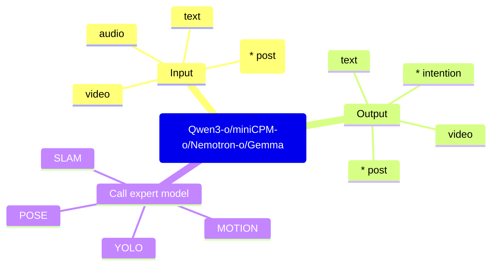

# 多模态模型选型调研

## 1. 调研目标

当前调研的核心议题：多模态大模型核心能力，模型规模，小模型天花板研究，能力评测

- 一个负责多模态理解、感知融合和任务规划的基座模型；
- 多个负责确定性感知任务的专家小模型；
- 面向姿态、动作预测和动作规划的 Motion 能力；
- 一套可以验证模型输出是否合理的评测方法。

最终目标是形成一条可落地路线：

> 多模态数据输入 -> 基座模型融合理解 -> 必要时调用专家模型 -> 输出语音提示、动作计划、姿态/意图预测或其他结构化结果。

## 2. 初步结论

### 2.1 主路线

优先采用“VLM 基座模型 + 专家小模型”的架构。

原因：

- VLM 适合做跨模态信息融合、任务理解、规划和自然语言交互；
- 小模型适合处理目标检测、定位建图、姿态估计、动作预测等确定性任务；
- 正确性更多取决于数据、动作表示、任务定义和专家模型能力，而不是单纯扩大基座模型参数量。
- 附：需要一定的开放世界交互，可以扩大参数 + 云端部署实现智能并小模型确保实时性（扩展情感助手等功能

### 2.2 模型规模判断

基座模型优先关注 7B 级别。

依据：

- 当前需要的主要能力是感知融合与规划，不是完整开放世界智能体能力；
- OpenVLA 一类模型的规模可作为参考；
- 如果不追求开放世界交互，模型正确性更多受数据质量和动作表示影响；
- 如果后续要求开放世界交互能力，模型规模需要向主流 LLM/VLM 靠拢。

### 2.3 候选基座模型

当前关注的 VLM / 多模态基座模型包括：

|模型|规模备注|定位|
|---|---:|---|
|Qwen3-o|30B-A3B|通用多模态基座候选|
|miniCPM-o|4B / 9B|轻量多模态基座候选|
|Nemotron-o|30B|通用多模态基座候选|
|Gemma|E2B / E4B / 26B-A4B|轻量到中等规模候选|

## 3. VLM 的能力边界

VLM 在当前系统中主要承担两类能力：

1. 多模态理解与规划  
   将视频、音频、文本、EMG、post 等信息编码为可供 LLM 理解的上下文，再输出 planning、解释、意图判断或动作建议。

2. 工具调用与任务分发  
   作为类 agent 中枢，根据任务需要调用 YOLO、SLAM、Pose、Motion 等专家模型，再综合专家模型的结果做最终判断。

这两类能力的技术路线不同：

- 前者强调“多模态输入 -> 基座模型直接理解 -> 输出计划”；
- 后者强调“专家模型先完成感知 -> 基座模型做融合与决策”。

当前更稳妥的路线是以后者为主，前者作为长期能力演进方向。

## 4. VLA 路线参考

VLA 更接近“视觉-语言-动作”模型，代表性工作包括：

- [Magma](https://arxiv.org/abs/2502.13130)
- [pai 0.5](https://arxiv.org/abs/2504.16054)
- [Gemini Robotics](https://deepmind.google/models/gemini-robotics/)

当前判断：

- VLA 与 VLM 在实现层面有相关性，尤其都涉及视觉、语言和具身任务；
- 但 VLA 主流仍偏动作预测或动作执行，不一定适合直接承担开放世界交互；
- 对当前机甲场景而言，VLA 可以作为中长期参考，不建议作为第一阶段主架构。

## 5. 专家小模型

专家小模型适合承担边界清晰、输出可验证的感知任务。

|方向|候选模型 / 方法|主要用途|
|---|---|---|
|目标检测|YOLO|识别目标、障碍物、交互对象|
|定位建图|SLAM|环境定位、空间建图|
|姿态估计|MediaPipe / RTMPose|人体关节点、姿态识别|
|动作预测|Motion 模型|未来动作、身体轨迹、意图趋势|

相关资料：

- [RTMPose: Real-Time Multi-Person Pose Estimation based on MMPose](https://arxiv.org/abs/2303.07399)
- [MediaPipe](https://github.com/google-ai-edge/mediapipe)
- [Human Motion Prediction, Reconstruction, and Generation](https://arxiv.org/abs/2502.15956)

### 5.1 姿态能力天花板

当前主流姿态检测仍以视觉方式识别第三人称人体关节为主。

对于第一人称人体姿态感知，可以考虑结合运动意图感知组捕获的物理数据，将姿态结果输出给基座模型。

## 6. Motion 能力专项

Motion 是当前场景中最需要单独拆出的能力，因为它直接影响动作预测、动作规划和机甲交互体验。

### 6.1 Motion 任务划分

|任务|输入|输出|对机甲价值|
|---|---|---|---|
|Motion Reconstruction|视频 / IMU|当前姿态|高|
|Motion Prediction|历史动作|未来动作|极高|
|Motion Generation|文本 / 条件|动作序列|中|
|Motion Planning|目标 + 环境|动作轨迹|极高|

对当前机甲最贴切的是：

- Motion Prediction：根据历史动作预测未来动作；
- Motion Planning：结合目标和环境规划动作轨迹。

### 6.2 技术路线

Motion 方向可以分为两类路线：

1. Expert Model  
   针对姿态、预测、生成、规划等单点任务分别训练或部署专家模型。当前主流仍是该路线。

2. Human Foundation Model / 大一统具身模型  
   用统一模型处理多模态输入输出，目标更接近机器人领域的 foundation model。该路线潜力更大，但落地成本和不确定性更高。

代表性工作：

- GitHub: [MDM](https://github.com/guytevet/motion-diffusion-model)
- Paper: [Human Motion Diffusion Model](https://arxiv.org/abs/2209.14916)

MDM 是 Motion 研究中的重要分界点，底层技术开始明显转向 Diffusion。

另一个方向是参考 LLM 的自回归机制，将状态离散化或投影为 token 流，再预测极短时间窗口内的状态变化。

- Paper: [Humanoid Locomotion as Next Token Prediction](https://arxiv.org/abs/2402.19469)

### 6.3 Motion 的不确定性

未来动作天然多解，不存在唯一答案。

例如，用户抬手可能对应拿水杯、摸头、挥手等多个意图。仅依赖当前动作很难确定唯一未来状态，因此 Motion Prediction 的目标不应只是预测一个动作，而应输出：

- 未来关节位置；
- 未来身体轨迹；
- 可能意图分布；
- 多候选动作及置信度。

这也是后续是否需要世界模型能力的关键问题。

## 7. 能力评测

评测应围绕“输出是否合理、是否可用、是否稳定”展开，而不是只看单次答案是否命中。

### 7.1 基座模型评测

- 多模态理解：能否同时理解视频、音频、文本、post、EMG 等输入；
- 规划能力：能否把复杂任务拆成正确步骤；
- 工具调用：能否判断何时调用专家模型；
- 结构化输出：能否稳定输出意图、动作计划、置信度等结构化结果；
- 错误恢复：专家模型结果冲突或缺失时，能否给出合理降级判断。

### 7.2 Motion 评测

主要方式：

- 对比原本预期与模型输出的差异；
- 反推模型预测是否合理；
- 不只评价唯一答案，而是评价候选动作集合是否覆盖真实意图；
- 对专业动作进行拆解评测，判断模型是否能根据指引输出正确步骤。

## 8. 总结

当前更合理的阶段性路线是：

> 以 VLM 作为感知融合与规划中枢，配合 YOLO、SLAM、Pose、Motion 等专家小模型完成确定性感知任务；Motion Prediction 和 Motion Planning 作为重点能力单独评估；VLA / 大一统具身模型作为中长期演进方向。
